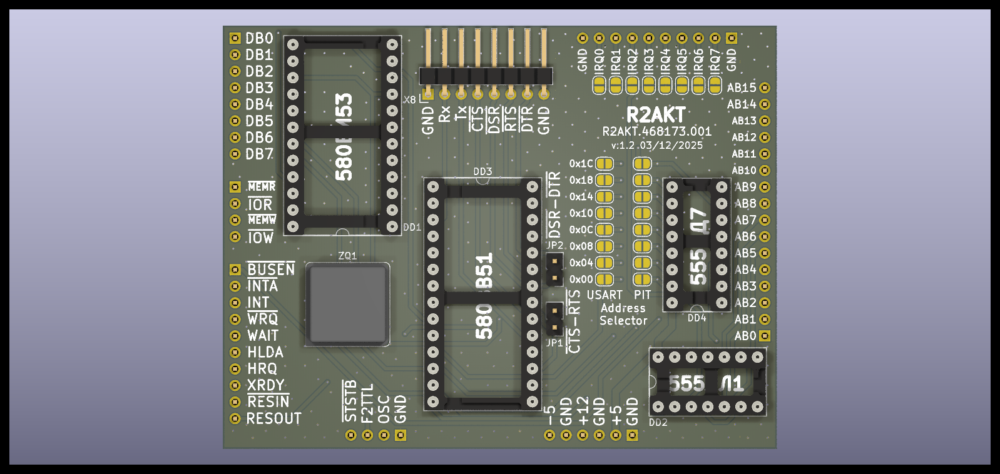

License addendum - https://github.com/R2AKT/USART/blob/main/Addendum.txt
# USART

Serial port module (USART). For Mega-80 (Mega-580) DIY 8-bit micro-computer - https://github.com/R2AKT/Mega-80.

Based on 580VV51 (8251) and 580VI53 (8253).

Status: Tested. Prescaler x1 and x16, speed up to 38400.

Модуль последовательного порта (USART). Для самодельной 8-битной микро-ЭВМ - https://github.com/R2AKT/Mega-80.

На основе 580ВВ51 (8251) и 580ВИ53 (8253).

Статус: Протестирован. Работает в режиме x1 и x16, на скорости до 38400.
